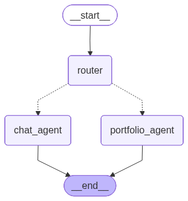

# Aivestia — AI 投资顾问

[English](README.md)

> 一个 AI 驱动的投资顾问教育演示项目，非持牌金融产品。

**在线体验：** https://www.aivestia.xyz

---

## 功能特性

| | |
|---|---|
| 🤖 **对话式 AI 顾问** | 通过流式聊天界面，随时咨询 ETF、风险等级、市场趋势或投资组合策略 |
| 🎯 **个性化投资组合推荐** | 基于规则的配置引擎，根据用户年龄、风险偏好、投资期限和兴趣进行个性化调整 |
| 🔀 **双代理架构** | LangGraph 根据意图将查询路由至聊天代理（市场信息）或投组代理（个性化推荐） |
| 🛡️ **幻觉检测机制** | 专用验证节点在生成最终回复前，验证所有答案是否完全基于工具输出 |
| 📈 **历史组合模拟** | 对比当前持仓与推荐投资组合的历史表现数据 |
| 📡 **实时市场数据** | 通过 Yahoo Finance 和 Finnhub 获取实时股价、52 周高低点及最新新闻 |
| 🧠 **RAG 投资知识库** | Pinecone 向量存储，收录 60+ 页投资概念（ETF、资产配置、现代投资组合理论） |
| 💬 **持久化聊天历史** | 完整对话历史存储于 PostgreSQL，支持 LangGraph 检查点 |

---

## 架构

### LangGraph 代理流程



```
User Message
     │
     ▼
  ┌──────┐
  │Router│  (gpt-4o-mini — classifies intent)
  └──┬───┘
     │
     ├─────────────────────┐
     ▼                     ▼
┌──────────┐        ┌───────────────┐
│Chat Agent│        │Portfolio Agent│
│ gpt-5.4  │        │   gpt-5.4     │
│          │        │               │
│ Tools:   │        │ Tools:        │
│ · price  │        │ · allocation  │
│ · news   │        │ · simulation  │
│ · RAG    │        │ · holdings    │
│ · sim*   │        │ · price/news  │
└────┬─────┘        └──────┬────────┘
     │                     │
     └──────────┬──────────┘
                ▼
     ┌──────────────────┐
     │Hallucination Check│  (gpt-4o-mini — binary grounding score)
     └────────┬─────────┘
              │
        ┌─────┴──────┐
        │ grounded?  │
        │  yes → FinalLLM
        │  no  → retry (max 2)
        └────────────┘
                ▼
          ┌──────────┐
          │ Final LLM│  (gpt-4o — polished user-facing response)
          └──────────┘
```

\* 聊天代理在用户明确请求时也可运行模拟。

### 部署架构

```
浏览器 → Vercel（React 单页应用）
              │
              ▼ HTTPS
         Nginx（限流 + 反向代理）
              │
              ▼
         AWS EC2（FastAPI + uvicorn）
              │
    ┌─────────┼──────────┬────────────┐
    ▼         ▼          ▼            ▼
 AWS RDS   Pinecone  Yahoo Finance  Finnhub
(PostgreSQL) (向量库)   (价格数据)   (新闻)
```

---

## 技术栈

### 后端
| | |
|---|---|
| **FastAPI** | REST API + SSE 流式传输 |
| **LangGraph** | 多代理编排，支持 PostgreSQL 检查点 |
| **LangChain** | 代理框架、工具集成、RAG 管道 |
| **OpenAI** | GPT-5.4（代理）· GPT-4o（最终 LLM）· text-embedding-3-small（RAG） |
| **PostgreSQL** | 聊天历史 · 用户数据 · LangGraph 状态持久化 |
| **Pinecone** | 投资知识检索向量存储 |
| **yfinance** | 历史及实时市场数据 |
| **Finnhub** | 公司新闻 API |

### 前端
| | |
|---|---|
| **React 19** | UI 框架 |
| **Vite** | 构建工具 |
| **Recharts** | 投资组合性能图表 |
| **SSE** | 实时流式响应 |

### 基础设施
| | |
|---|---|
| **AWS EC2** | 后端托管 |
| **AWS RDS** | 托管 PostgreSQL |
| **Nginx** | 反向代理 · 限流 |
| **Vercel** | 前端部署 |

---

## 项目结构

```
aivestia/
├── ai-service/
│   ├── main.py                  # FastAPI 应用 — 所有 REST 端点
│   ├── core.py                  # LangGraph 流式/调用封装
│   ├── database.py              # PostgreSQL 连接 + 数据库初始化
│   ├── ingestion.py             # RAG 管道：爬取 → 分块 → 嵌入 → Pinecone
│   ├── graph/
│   │   ├── graph.py             # LangGraph 工作流定义
│   │   ├── state.py             # GraphState TypedDict
│   │   └── nodes/               # 路由器、聊天代理、投组代理、幻觉检测、最终 LLM
│   ├── agents/
│   │   ├── chat_agent.py        # 通用市场信息代理
│   │   └── portfolio_agent.py   # 个性化投资组合推荐代理
│   ├── services/
│   │   ├── portfolio_service.py # 基于规则的配置引擎 + 兴趣倾斜
│   │   ├── performance_service.py # 历史模拟
│   │   └── market_data_service.py # yfinance 封装
│   └── tools/                   # LangChain 工具定义
│
└── frontend/
    └── src/
        ├── pages/               # HomePage、ChatPage、HowItWorksPage、AboutPage
        └── components/          # SimulationCard、PortfolioForm、SuggestionBar 等
```

---

## API 参考

| 方法 | 端点 | 说明 |
|------|------|------|
| `POST` | `/users` | 创建或更新用户（记录 IP） |
| `GET` | `/users/{user_id}/chats` | 列出用户聊天会话 |
| `POST` | `/users/{user_id}/chats` | 创建新聊天会话 |
| `PATCH` | `/chats/{chat_id}/title` | 重命名聊天 |
| `DELETE` | `/chats/{chat_id}` | 删除聊天及其消息 |
| `GET` | `/chats/{chat_id}/messages` | 获取聊天消息历史 |
| `POST` | `/chat/stream` | **SSE 流式聊天**（主端点） |
| `POST` | `/portfolio` | 获取基于规则的投资组合配置 |
| `POST` | `/portfolio/performance` | 运行历史组合模拟 |
| `POST` | `/suggestions` | 生成 3 个后续问题建议 |

`ENV=dev` 时 API 文档可在 `/docs` 访问。

---

## 投资组合配置逻辑

投资组合配置完全**确定性**——投资决策不涉及 AI。

**各风险等级基线配置：**

| 风险 | VTI | VXUS | BND |
|------|-----|------|-----|
| 低 | 30% | 20% | 50% |
| 中 | 60% | 30% | 10% |
| 高 | 80% | 20% | — |

**兴趣倾斜**通过增加以下方向的敞口来调整基线：
`科技成长` · `股息收入` · `ESG` · `国际市场` · `REITs` · `债券` · `价值投资` · `中小盘`

最多应用 3 个兴趣（主要 +10%，次要 +5%），总调整上限 20%。

---

## 免责声明

Aivestia 是一个**教育演示项目**，不是持牌金融顾问、经纪商或投资产品。所有投资组合建议仅供演示，不构成投资建议。在做出任何投资决策前，请咨询合格的专业金融顾问。

---

## 联系方式

aivestia.ai@gmail.com
